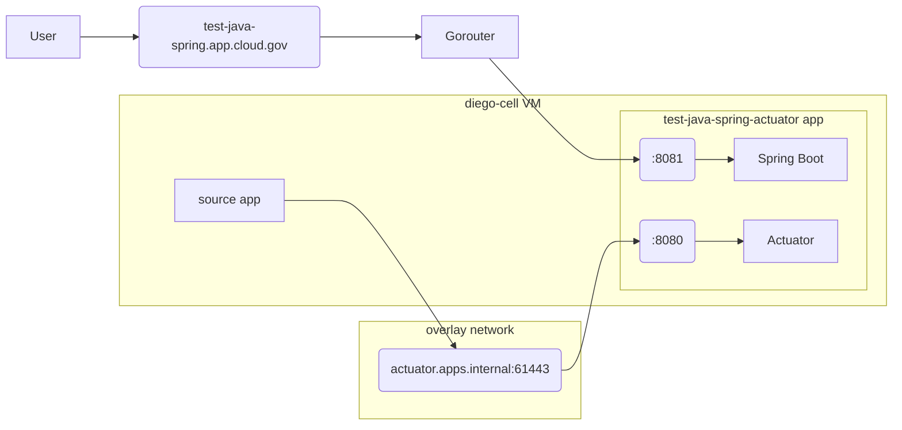

# How to deploy the Java Spring Actuator example app

This example application demonstrates the ability to:

- [route traffic to a custom port on a CloudFoundry application][custom-ports]
- [use multiple routes to connect to multiple ports opened by an application][custom-ports]
- [connect to an application using an internal route](https://docs.cloudfoundry.org/devguide/deploy-apps/routes-domains.html#internal-routes)
- [use secure container-to-container networking with TLS][secure-c2c-with-tls]

## Build the application

First, use the following command to download all of the dependencies and create the application for deploying.

### Mac OS X, Unix, or Linux

```bash
./mvnw compile
./mvnw package
```

## Windows

```powershell
.\mvnw.cmd compile
.\mvnw.cmd package
```

## Deploy the application and configure the networking

1. After building the application, follow the usual process for deploying:

    ```bash
    cf push --var app-domain=app.cloud.gov
    ```

2. Use the provided shell script to update the route for the Spring Boot process to listen on port `8081` (configured in [`manifest.yml`](./manifest.yml)):

    ```shell
    ./set-route-custom-port.sh <org> <space> test-java-spring-actuator test-java-spring-boot 8081
    ```

3. Restart the app so the route is properly handled:

    ```shell
    cf restart test-java-spring-actuator
    ```

4. Add a network policy allowing a separate app to reach the internal route for the Actuator process:

    ```shell
    cf add-network-policy SOURCE_APP test-java-spring-actuator --protocol tcp --port 61443
    ```

You should be able to successfully make a request to the route for the Spring Boot process:

```shell
$ curl https://test-java-spring-boot.app.cloud.gov/
Greetings from cloud.gov!
```

And if you `cf ssh SOURCE_APP`, you should be able to successfully make a request to the health check endpoint for the Acutator component:

```shell
$ curl https://actuator.apps.internal:61443/actuator/health
{"status":"UP"}
```

## How it works



There are two processes running in the `test-java-spring-actuator` app:

- Spring Boot on port `8081` (configured in [`manifest.yml`](./manifest.yml))
- Actuator on port `8080` (configured in [`src/main/resources/application.properties`](./src/main/resources/application.properties))

Traffic is routed to the processes as follows:

- Requests to the route `test-java-spring.app.cloud.gov` go over the public internet and hit the Gorouter, which directs the request to port `8081` on the `test-java-spring-actuator` app. By default, a route would usually go to port `8080` on the app, but we updated the route to use port `8081` using the [`set-route-custom-port.sh`](./set-route-custom-port.sh) script.
- Requests to the route `actuator.apps.internal:61443` from a separate application go through a container overlay network to the `test-java-spring-actuator` app. These requests **do not go out to the public internet**. By default, [requests to port `61443` for secure container-to-container networking are proxied to port `8080`](secure-c2c-with-tls), so the request hits port `8080` in the container and thus the Actuator process.

## Helpful resources

- [Configuring Cloud Foundry to route traffic to apps on custom ports][custom-ports]
- [Building a RESTful Web Service with Spring Boot Actuator](https://spring.io/guides/gs/actuator-service/)
- [Container to container networking in CloudFoundry](https://docs.cloudfoundry.org/concepts/understand-cf-networking.html)
- [Securing Container-to-Container Networking with TLS][secure-c2c-with-tls]

[custom-ports]: https://docs.cloudfoundry.org/devguide/custom-ports.html
[secure-c2c-with-tls]: https://www.cloudfoundry.org/blog/secure-container-networking-with-tls/
